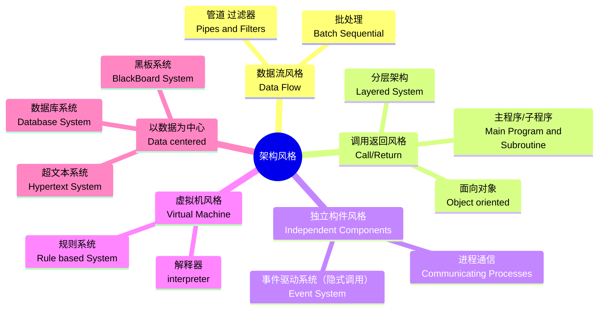

## 基础组件介绍

### 中间件

常见分类方式

## 构件与中间件技术-构件标准

三大构件标准

* CORBA
* J2EE[EJB]
  * 会话Bean：**实现业务逻辑**，完成服务端和客户端的交互
  * 实体Bean：**实现O/R映射**，简化数据库开发工作
  * 消息驱动Bean：**处理并发与异常访问**
* DNA 2000

## 构件与中间件技术-CORBA

解决跨平台的问题，比如远程调用。

**了解组成部分的各个职能**

**伺服对象**，**对象适配器**，**对象请求代理**

了解上面三个内部组件的职能。

# 架构设计

不同主题的架构，即不同风格的架构

## 软件架构风格

什么是架构风格？

> 架构风格定义了用于描述系统的**术语表**和一组指导构件系统的**规则**

案例分析

* 了解各种架构风格各自的特点和规则和局限性，才能应对案例分析中的架构选型
* 当题目中已经明确了采用某种架构风格，需要进行分析，那么必然，选中的架构风格能够很好的支撑XXX（比如数据处理），而未被选中的架构风格则对这种场景下的支持是有限的。
* 找场景下的优劣势。
  * 比如题目中要求交互，则必然选中的架构风格能有很好的支持交互式，未被选中的架构对交互的支持有限
  * 比如性能有要求，则选中的架构风格能够应对高并发，处理速度快，未被选中的架构则无法支持较高的性能或者支撑高性能比较难以实现
* 

## B/S架构和C/S架构

两层C/S（胖客户端）,三层C/S（瘦客户端，仅界面），和三层B/S（零客户端）

比如安卓app，应该属于三层C/S，界面变动需要变动客户端，业务逻辑内部变动，不需要更新客户端。

## 常用层次架构

现在前端，VUE，React 都是MVVM模型，使用数据的双向绑定，采用了虚拟BOM，来让视图、数据统一。

层级的好处，每一层都只需要关注于自己层的功能，通过层来隔离不同的关注点

主要是为了解决两个问题：

* 如何快速拆解功能问题
* 如何提升代码的可拓展性

在架构中，分层，也使得服务的横向拓展变得更加简单。比如service层拓展，data层拓展，等等

总结好处：

* 只需要关注整个结构中的某一层的具体实现
* 降低层与层之间的依赖
* 很容易进行层替换，用新的实现来替换原有层的实现
* 有利于标准化的统一
* 各层逻辑方便复用

**责任分离**，**解耦**，**组件复用**和**标准制定**

劣势：

* 开发成本高，高层次增加功能，可能需要多个底层增加代码，增加开发成本。
* 性能降低：多个层，增加了调用链路，增加耗时，影响性能
* 代码复杂度增加。层与层直接还是高度耦合的，开发时需要增加很多层之间的调用

## RIA架构风格

典型的，微信游戏小程序，无需下载直接畅玩。

HTML5这边也提供了新的功能，也就是Wasm功能,可能让浏览器借助原生虚拟化，进行性能提升，比如Adobe就在招聘团队实现浏览器PhotoShop。

## 数据访问模式

